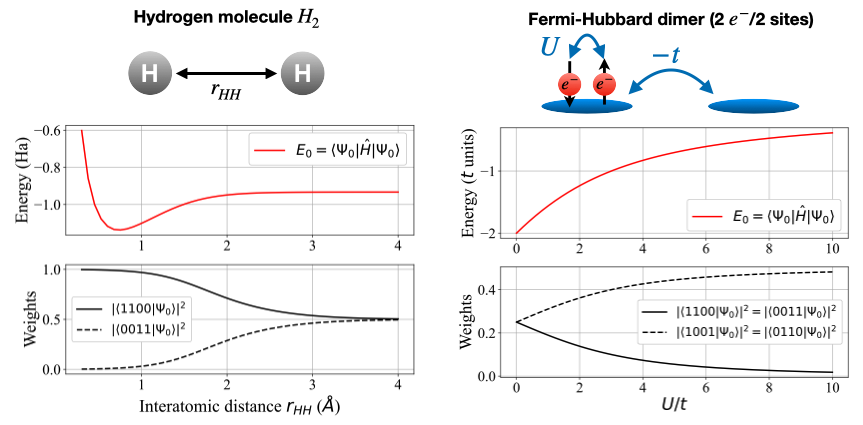

---
Title:
'Quant_N_Body : an exact diagonalization python package for quantum chemistry and many-body Hamiltonians'
tags:
  - Python
  - quantum physics and chemistry
  - quantum many-body systems
  - exact diagonalization
authors:
  - name: Yalouz S.^[yalouzsaad@gmail.com] #^[Co-first author] # note this makes a footnote saying 'Co-first author'
    orcid: 0000-0002-8818-3379
    affiliation: 1 # (Multiple affiliations must be quoted)
  - name:  Martin Rafael Gullin # note this makes a footnote saying 'Co-first author'
    affiliation: 1
  - name: Sajanthan Sekaran
    affiliation: 1
affiliations:
 - name: Laboratoire de Chimie Quantique, 4 rue Balise Pascal, 67000 Strasbourg, France
   index: 1 
date: 13 August 2017
bibliography: paper.bib

# Optional fields if submitting to a AAS journal too, see this blog post:
# https://blog.joss.theoj.org/2018/12/a-new-collaboration-with-aas-publishing
#aas-doi: 10.3847/xxxxx <- update this with the DOI from AAS once you know it.
#aas-journal: Astrophysical Journal <- The name of the AAS journal.
---

# Summary 

This Python package provides numerical tools for quantum chemists/physicists interested in the development of methodologies to study quantum many-body problems ranging from electronic structure to condensed matter. It provides a quick and easy way to build matrix representations of quantum many-operators (e.g. hamiltonians, spin operators) and get access to important quantities/objects (e.g. reduced density matrices, many-body wave functions). The code comes with various native operators implemented and is flexible enough to help users in building new types of operators. 

# Statement of need

Exact diagonalization method is an important tool to get access to exact properties
of either ab initio or model quantum many-body systems. In practice, it requires to
develop a code that can encode a matrix representation of quantum
operators (e.g. the Hamiltonian of a system) in a given quantum many-body basis.
Usually in numerical packages, this practical aspect is kept as a “blackbox” (e.g. hidden
inside the code) to spare the user with these cumbersome numerical parts. This practice is
particularly suitable for realizing application however, it turns out to be problematic
for researchers in need of numerical tools to develop and test new methodologies and theories. 

The Python package “QuantNBody” has been developed to help theoreticians in quantum chemistry and physics who need a quick and easy way to numerically create and manipulate objects linked to quantum many-body systems. All of its framework is based on the creation of matrix representation of quantum operators in a given many-body basis. 

The framework of the package is focus on two fundamental steps which are :

- Creating a many-body basis

 the particle number preserving operator 

$ a^\dagger a $

# Statement of need

`Gala` is an Astropy-affiliated Python package for galactic dynamics. Python
enables wrapping low-level languages (e.g., C) for speed without losing
flexibility or ease-of-use in the user-interface. The API for `Gala` was
designed to provide a class-based and user-friendly interface to fast (C or
Cython-optimized) implementations of common operations such as gravitational
potential and force evaluation, orbit integration, dynamical transformations,
and chaos indicators for nonlinear dynamics. `Gala` also relies heavily on and
interfaces well with the implementations of physical units and astronomical
coordinate systems in the `Astropy` package (`astropy.units` and
`astropy.coordinates`).

`Gala` was designed to be used by both astronomical researchers and by
students in courses on gravitational dynamics or astronomy. It has already been
used in a number of scientific publications   and has also been
used in graduate courses on Galactic dynamics to, e.g., provide interactive
visualizations of textbook material . The combination of speed,
design, and support for Astropy functionality in `Gala` will enable exciting
scientific explorations of forthcoming data releases from the *Gaia* mission
by students and experts alike.

# Mathematics

Single dollars ($) are required for inline mathematics e.g. $f(x) = e^{\pi/x}$

Double dollars make self-standing equations:

$$\Theta(x) = \left\{\begin{array}{l}
0\textrm{ if } x < 0\cr
1\textrm{ else}
\end{array}\right.$$

You can also use plain \LaTeX for equations
\begin{equation}\label{eq:fourier}
\hat f(\omega) = \int_{-\infty}^{\infty} f(x) e^{i\omega x} dx
\end{equation}
and refer to \autoref{eq:fourier} from text.

# Citations

Citations to entries in paper.bib should be in
[rMarkdown](http://rmarkdown.rstudio.com/authoring_bibliographies_and_citations.html)
format.

If you want to cite a software repository URL (e.g. something on GitHub without a preferred
citation) then you can do it with the example BibTeX entry below for @fidgit.

#For a quick reference, the following citation commands can be used:
#- `@author:2001`  ->  "Author et al. (2001)"
#- `[@author:2001]` -> "(Author et al., 2001)"
#- `[@author1:2001; @author2:2001]` -> "(Author1 et al., 2001; Author2 et al., 2002)"

# Figures

Figures can be included like this:
#
#and referenced from text using \autoref{fig:example}.

#Figure sizes can be customized by adding an optional second parameter:
#{ width=20% }

# Acknowledgements

# References­
